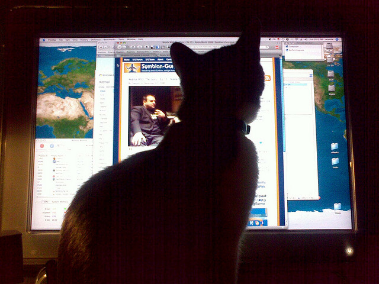
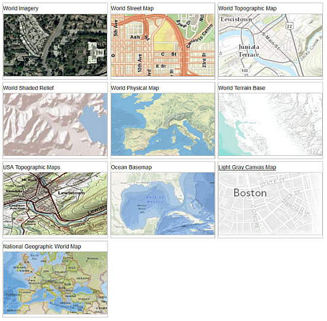
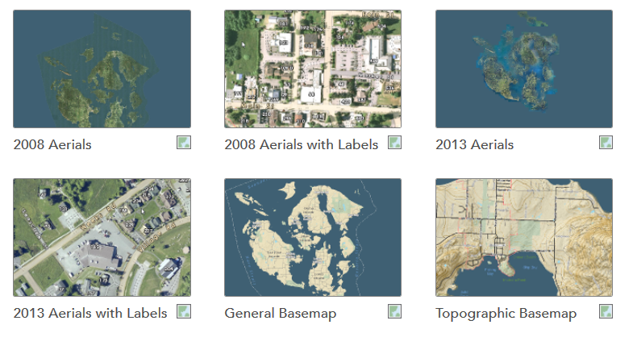
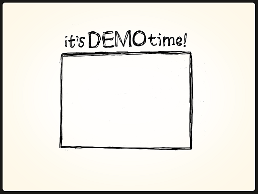
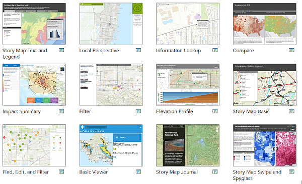

# SJC GIS Users Group
February 11, 2015

San Juan County GIS

sjcgis@sanjuanco.com

---

## Using ArcGIS Online to create web maps

---

## What is ArcGIS Online?

[Link](http://doc.arcgis.com/en/arcgis-online/reference/faq.htm#anchor1)

> ArcGIS Online is a collaborative, cloud-based platform that allows members of an organization to use, create, and share maps, scenes, apps, and data, and access authoritative basemaps and ready-to-use apps. 

Note: ArcGIS Online is a collaborative, cloud-based platform that allows members of an organization to use, create, and share maps, scenes, apps, and data, and access authoritative basemaps and ready-to-use apps. 

---

## Umm, what?

Note: Not up for the buzzwords and lingo? OK. 

---

## Simple web map creation

Note: ArcGIS Online can be used by Esri customers to make a web map that can be viewed by others.

---

## A web map...

is simple

tells a single story

is easily understood

---

## Parts of a web map

---

## Basemaps

Static

Provides context

Note: Basemaps are static maps that give context. They can be aerial imagery, street maps, topo maps.

---

### Esri basemaps

---

### Esri basemaps

 + Pretty

 + Worldwide

 - Not always accurate

---

### San Juan County basemaps

---

### San Juan County basemaps

 + Accurate

 + Larger scales

 - Only San Juan County

---

## Operational layers

Only one or two

Call to attention

Note: This is the meat of the sandwich and what you want your audience to focus on. This should tell the story or supply important information.

---

---

## Web *apps*

Additional capabilities

Examples: legends, filters, editing

Note: Web applications or apps add capabilities to web maps. You can add a legend, a paragraph describing the map, filters, data editors, etc.
 
---

## Making custom web maps is...

---

## Custom web *apps* are not

---

## Fortunately...

---

## Customizable web apps

---

## Another demo

---

# Thanks
San Juan County GIS

sjcgis@sanjuanco.com

---

## Image Attribution

Confused Cat [Mouser Nerdbot](https://www.flickr.com/photos/mouser-nerdbot) [CC-BY-NC-ND-2.0](https://creativecommons.org/licenses/by-nc-nd/2.0/), [via Flickr](https://www.flickr.com/photos/mouser-nerdbot/3177886037/)

Computer Cat [Andrew Curie](https://www.flickr.com/photos/andrewcurrie/) [CC-BY-2.0](https://creativecommons.org/licenses/by/2.0/), [via Flickr](https://www.flickr.com/photos/andrewcurrie/3093640036/)

Bread [Rainer Zenz](//de.wikipedia.org/wiki/User:Rainer_Zenz) [CC-BY-SA-3.0](http://creativecommons.org/licenses/by-sa/3.0/), [via Wikimedia Commons](http://commons.wikimedia.org/wiki/File%3AKommissbrot.jpg)

Cat Sandwich [Kalgani Turner](http://www.flickr.com/photos/kaioshin) [CC-BY-NC-2.0](https://creativecommons.org/licenses/by-nc/2.0/), [via Flickr](http://www.flickr.com/photos/kaioshin/4469404252/)

Demo Time [Mike Rohde](https://www.flickr.com/photos/rohdesign/) [CC-BY-NC-ND-2.0](https://creativecommons.org/licenses/by-nc-nd/2.0/), [via Flickr](https://www.flickr.com/photos/rohdesign/3521269974/)

Easy Button [Civilian Scrabble](https://www.flickr.com/photos/nmcmanus/) [CC-BY-2.0](https://creativecommons.org/licenses/by/2.0/), [via Flickr](https://www.flickr.com/photos/nmcmanus/338391435/)

Demolition by Zunaid [CC BY-SA 3.0](http://creativecommons.org/licenses/by-sa/3.0), [via Wikimedia Commons](http://commons.wikimedia.org/wiki/File%3AAthlone_cooling_towers_demolition_2010-08-22.gif)

---

## Other Resources

[Tutorial - Get started with ArcGIS Online](http://learn.arcgis.com/en/projects/get-started-with-arcgis-online/)

[Video - Get started with ArcGIS Online](http://video.arcgis.com/watch/3958/get-started-with-arcgis-online)

[Anatomy of a Web Map](http://maptime.io/anatomy-of-a-web-map/)

