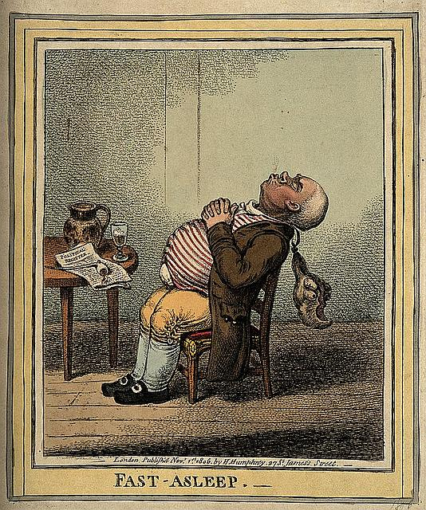
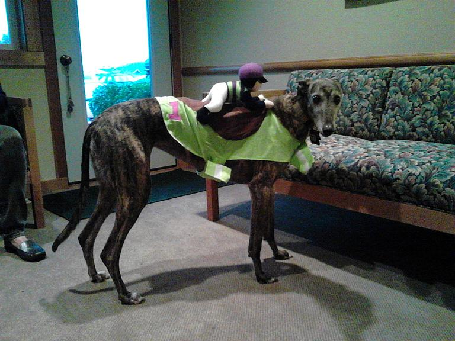
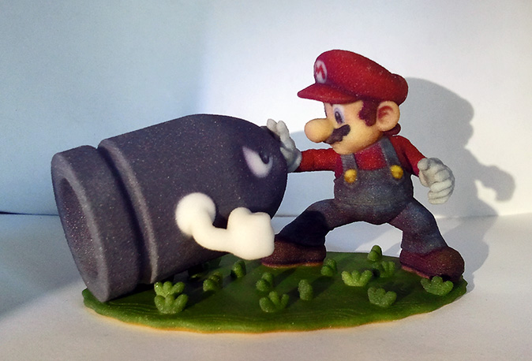
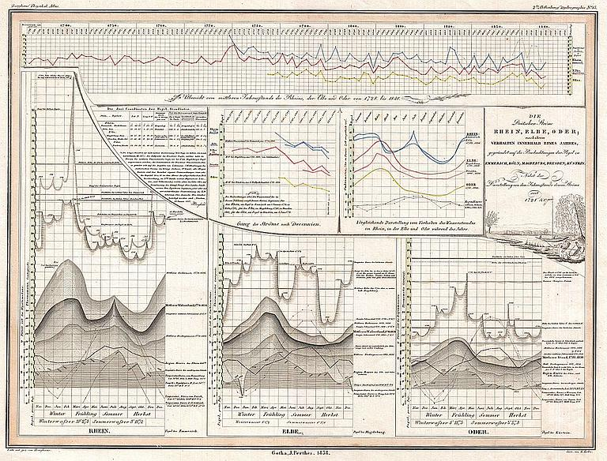
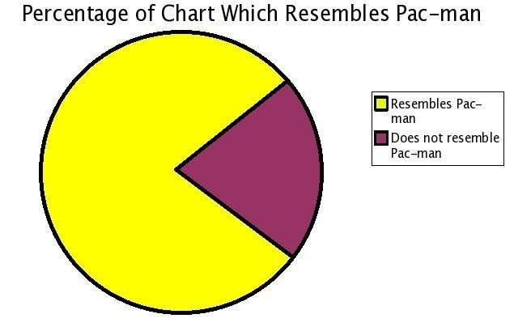
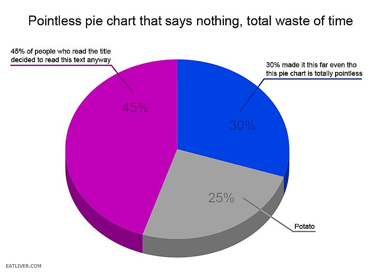

# SJC GIS Users Group
	November 12, 2014

---

## Powerpoint: Just Say No

---

## Why not Powerpoint?

--

--

---

## Pro-tip #1
	Don't read off your slides

	Slides should have images or very short text

Note: Use speaker notes to read from. This is the white text box below your Powerpoint slide and it's only visible to you. Your audience doesn't want to read the entire slide. They should be paying attention to you and only referring to the slide for quick reference.

---

## Example

--

## Last Summer

Note: Last summer (2013) we packed up and moved from SoCal to SJI. 

--

## Then

Note: Then we adopted Paige, an ex-racing greyhound. She raced in FL and MA before retiring to SJI.

---

## Still awake? Good!

Note: Keep in mind, laughter is the best way for both you and the audience to feel more comfortable.

---

## No more bulleted lists!

Note: The default slide in Powerpoint is a bulleted list of points. This is BORING! A better option is to put each point on a separate slide. Perhaps as a title with a poigniant or humorous image.

---

## Presenting Data

Note: This is not a good chart for a presentation. This works better as a handout for someone to examine after the presentation.

---

## Picking the right chart
[Use this diagram](http://www.labnol.org/software/find-right-chart-type-for-your-data/6523/)

Note: Here's a handy diagram showing which chart to use for which data type.

---

## But pie charts?!?

--

## NO!

Note: 99% of the time you want a bar chart instead of a pie chart

---

## 
