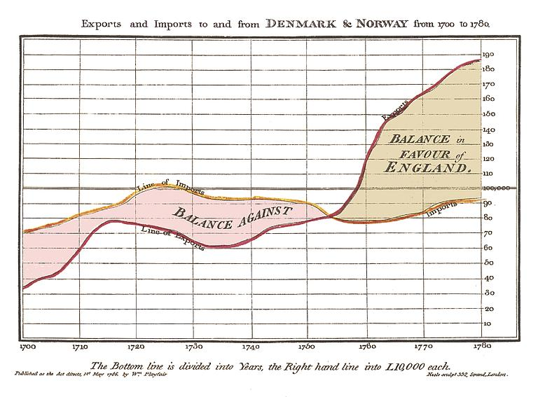

# SJC GIS Users Group
	November 12, 2014
	San Juan County GIS
	sjcgis@sanjuanco.com

---

## Powerpoint: Just Say No

---

## Why not Powerpoint?

---

Note: (Turn around and read off slide)

---

Note: Wow, that was a boring slide. Yet, so many people do it this way. 

---

## Pro-tip #1
	Don't read off your slides

	Images or very short text

	Speaker notes (press 'S' to view mine)

Note: Use speaker notes to read from. This is the white text box below your Powerpoint slide and it's only visible to you. Your audience doesn't want to read the entire slide. They should be paying attention to you and only referring to the slide for quick reference.

---

## Example

---

## Last Summer

Note: Last summer (2013) we crammed our belongs and cats into our cars and moved from SoCal to SJI. 

---

## Then

Note: Then we adopted Paige, an ex-racing greyhound. She raced in FL and MA before retiring to SJI. She's super lazy but very friendly.

---

## Still awake? Good!

Note: Keep in mind, laughter is the best way for both you and the audience to feel more comfortable.

---

## No more bulleted lists!

Note: The default slide in Powerpoint is a bulleted list of points. This is BORING! A better option is to put each point on a separate slide. Perhaps as a title with a poigniant or humorous image. Bullet points can be used to introduce subjects using one or two words.

---

## Picking the right chart
[Use this diagram to help](http://img.labnol.org/di/choosing_a_good_chart2.pdf)

Note: Here's a handy diagram showing which chart to use for which data type.

---

## But pie charts?!?

---

## NO!

Note: 99% of the time you want a bar chart instead of a pie chart

---

## Simple Charts for Slides

Note: Use simple charts for slides. These should have large, legible text and be quickly understood by the audience.

---

### Handouts for Complex Charts

Note: Put complex charts on handouts or in reports instead of on slides. Refer to a page number in a report if necessary.

---

# Powerpoint Alternatives

 - [Slides.com](http://slides.com)

 - [Prezi.com](http://prezi.com)

Note: These are two alternatives to Powerpoint. They rely on internet web applications rather than pricey software. They have free accounts up to a certain amount of storage, above that they price per month. I'm still testing them and haven't explored too deeply.

---

## Slides.com

This presentation.

'Space' - advance through slides

'Esc' - view all slides

Note: Extremely simple framework. Not too difficult to use.

---

## Prezi

 - [County Example](https://prezi.com/ncnx6vanshxr/administration/)

 - [Free-falling Example](https://prezi.com/d3lswto1mebc/free-falling-through-prezi/)

Note: This has a nice editing interface. But it requires Flash to work, so you'd need to install their free app on tablets to view the presentation.

---

# Thanks
	San Juan County GIS
	sjcgis@sanjuanco.com

---

## Questions? Comments?

